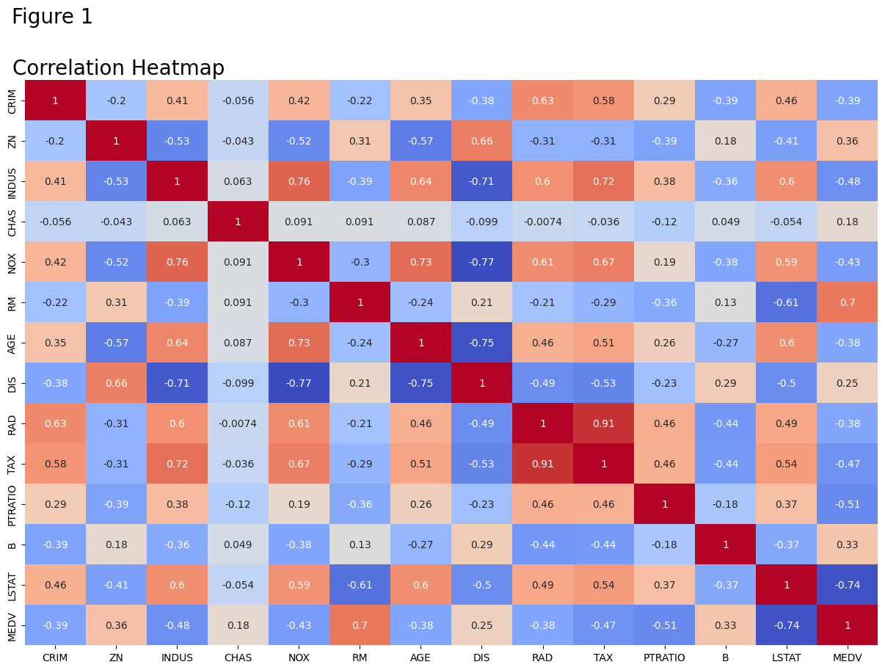
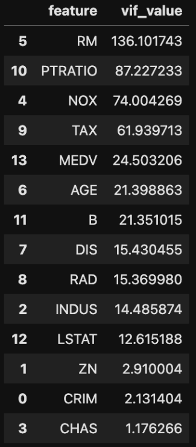
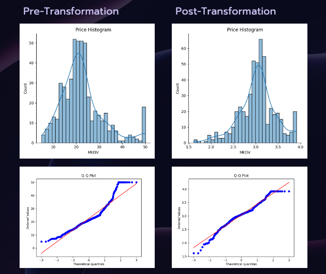
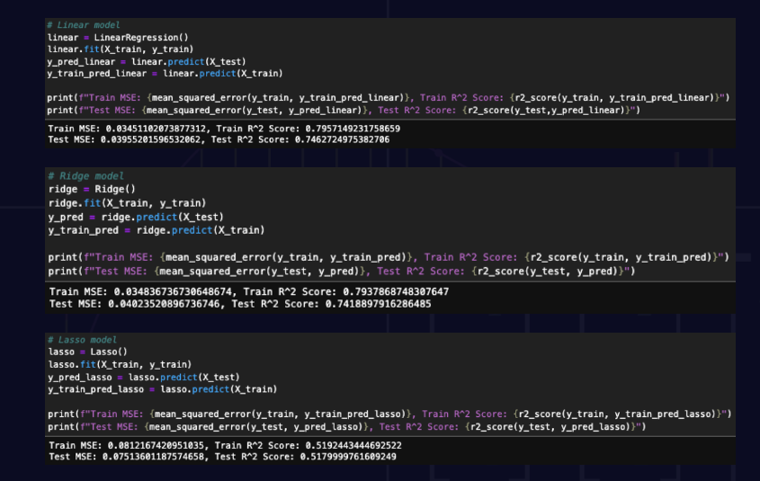
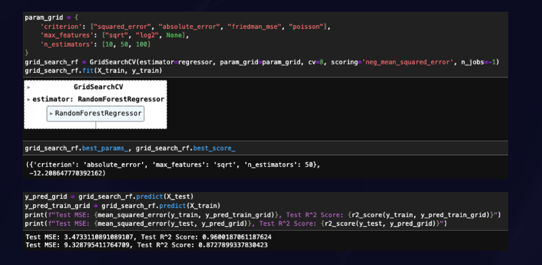
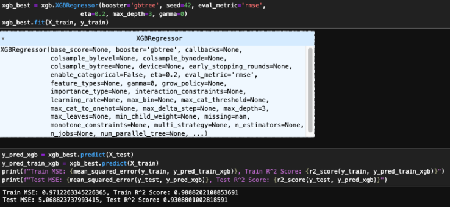

# House Prices Prediction

---

## Purpose and Research Question

### Purpose 🎯
- To predict house prices using machine learning algorithms and explore effective models.
- To offer valuable insights to homeowners and potential buyers in the current market.

### Research Question ❓
- Which machine learning algorithms produce the most reliable predictions for house prices?

---

## Dataset and Source

### Dataset 📊
- The data was drawn from the Boston Standard Metropolitan Statistical Area (SMSA) in 1970 concerning prices and other attributes of houses in Boston.

### Source 🔍
- The data set was originally compiled by Harrison D. and Rubinfeld D.L. in their paper "Hedonic prices and the demand for clean air". It was part of a study to examine the relationship between air quality and house prices. It can be downloaded from Kaggle.com.

---

## Variables

### Input Variables
- 12 continuous variables and 1 binary variable are included in this dataset as input variables.
1. CRIM      per capita crime rate by town
2. ZN        proportion of residential land zoned for lots over 
             25,000 sq.ft.
3. INDUS     proportion of non-retail business acres per town
4. CHAS      Charles River dummy variable (= 1 if tract bounds 
             river; 0 otherwise)
5. NOX       nitric oxides concentration (parts per 10 million)
6. RM        average number of rooms per dwelling
7. AGE       proportion of owner-occupied units built prior to 1940
8. DIS       weighted distances to five Boston employment centres
9. RAD       index of accessibility to radial highways
10. TAX      full-value property-tax rate per $10,000
11. PTRATIO  pupil-teacher ratio by town
12. B        1000(Bk - 0.63)^2 where Bk is the proportion of blacks 
             by town
13. LSTAT    % lower status of the population

### Output Variable
- The output variable is MEDV (median value of owner-occupied homes in 1000's).

---

## Data Preprocessing

1. **Missing Values 🤔**  
   - There is no missing value in this dataset.

2. **Feature Scaling 📏**  
   - Feature scaling is applied only to the linear regression model because random forest and XGBoost do not require feature scaling.

---

## Exploratory Analysis

### Heatmap

### Variance Inflation Factor
The Variance Inflation Factor (VIF) is a measure used to detect the presence of multicollinearity in a regression analysis. Multicollinearity occurs when two or more independent variables in a regression model are highly correlated, which can make it difficult to estimate the relationship between each independent variable and the dependent variable accurately.

- **VIF = 1:** No correlation between variables.
- **VIF < 5:** Moderate correlation but often considered acceptable.
- **VIF > 5:** Indicates a problematic amount of correlation and suggests that variables might suffer from multicollinearity.
- **VIF > 10:** Indicates high multicollinearity. Variables with a high VIF may need to be removed or feature transformation is needed.

Based on the heatmap and VIF, we need to reconsider if some factors should be used in a regression model.

---

## Data Splitting

### Training and Test sets 🎓
- There are 506 instances in this example, which is a very small dataset. Instead of partitioning data into training, validation, and test sets, cross-validation is used for tuning. The dataset is split into 80-20 style.

### Pre-Transformation
- The left side of the image shows the original price distribution (top-left) and its corresponding Q-Q plot (bottom-left).
- The price histogram reveals that the data is slightly skewed to the right.
- The Q-Q plot shows deviations from the normal distribution, particularly at the ends, indicating that the original data does not perfectly follow a normal distribution.

### Post-Transformation (right-side)
- After transformation, the price histogram shows a more normalized distribution, with less skewness compared to the original data.
- The Q-Q plot indicates that the transformed data better aligns with the theoretical quantiles of a normal distribution.

---

## Algorithm Implementation

1. **Linear Regression 📉**  
   - Linear Regression is an approach for predicting numerical values.

2. **Random Forest 🌳**  
   - Random Forest is an ensemble learning technique that combines multiple decision trees to improve accuracy.

3. **XGBoost 🚀**  
   - XGBoost is a boosting algorithm known for its speed and accuracy.

---

## Linear Regression

---

### Linear Regression Conclusion
- The linear model without any regularization performs the best among the three linear models.
- 80% of the variance can be explained by the independent variables in the training set while 74% of the variance can be explained by the independent variables in the testing set.

---

## Random Forest

### Random Forest Conclusion
- The Random Forest model suffers from overfitting.
- However, both testing and training sets' R² scores are better than the ridge model.
- **Advantages to consider:**
  - Random Forest does not require feature scaling.
  - Random Forest has fewer assumptions.

---

## XGBoost

### XGBoost Conclusion
- 98% and 93% of the variance can be explained by the variables in the training set and testing set respectively.
- The MSE scores may indicate overfitting because the MSE from the testing set is much higher.

---

## Summary Table (Training)

| Algorithm         | MSE   | R² Score |
| ----------------- | ----- | --------:|
| Linear Regression | 0.035 |     0.800|
| Random Forest     | 3.473 |     0.960|
| XGBoost           | 0.971 |     0.989|

---

## Summary Table (Testing)

| Algorithm         | MSE   | R² Score |
| ----------------- | ----- | --------:|
| Linear Regression | 0.040 |     0.746|
| Random Forest     | 9.329 |     0.873|
| XGBoost           | 5.069 |     0.931|

---

## Final Thoughts

### Findings 👀
- Among the three algorithms, XGBoost seems to perform the best for house prices prediction. However, both random forest and XGBoost models may suffer from overfitting.
- Feature scaling and transformation need to be applied if one desires to use linear regression to predict house prices because of high multicollinearity.

### Future Work 🚀
- The dataset indicates high multicollinearity, and feature transformation is needed to handle this problem.
- The dataset contains about 500 instances, which is relatively small. Having a larger dataset can potentially solve the issue of overfitting.
- More advanced techniques such as Neural Networks can be tested in this field.

